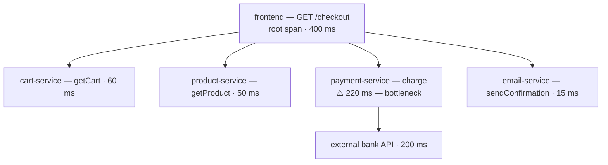
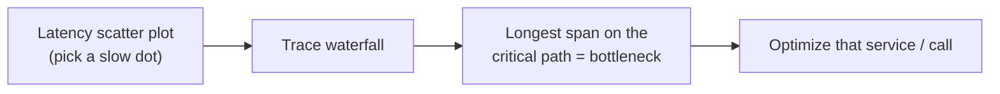

# 00 — Distributed Tracing with Cloud Trace

> Reference notes (see [provenance](README.md#provenance)). Maps to **L9.1 · L9.4** and the
> *Using Cloud Trace to View Application Latency* lab.

## What it is

**Cloud Trace** is a **distributed tracing** system: it follows a single request as it moves
**across services** and shows **where the time goes**, so you can find the **latency
bottleneck** instead of guessing.

## Core concepts

- **Trace** — the end-to-end record of one request; a **tree of spans**.
- **Span** — one **named, timed unit of work** (an RPC, a handler, a DB query) with a start
  time, duration, attributes/labels, and a **parent** span. The **root span** = the whole
  request.
- **Trace context propagation** — the **trace ID + span ID** are passed across service
  boundaries (usually HTTP headers like `traceparent` / `X-Cloud-Trace-Context`) so spans
  from different services stitch into one trace.
- **Instrumentation** — code emits spans via **OpenTelemetry** or Cloud Trace client
  libraries (auto-instrumentation for common frameworks, or manual spans).
- **Sampling** — only a fraction of requests are traced to control overhead.

## A request as a span tree

## Reading the waterfall (how you find the bottleneck)

The **trace waterfall** lays each span on a timeline (bar = duration, indented under its
parent). Steps:
1. Open **Cloud Trace → Trace explorer** and pick a slow request (or the latency scatter plot).
2. Open its **waterfall**; scan for the **longest bar** / the deepest span on the **critical
   path**.
3. That span's service + operation is your bottleneck (e.g. a slow downstream API or DB call).

## Also in Cloud Trace

- **Latency distribution** — histogram of request latencies (spot p99 tail).
- **Analysis reports** — compare latency over time / find regressions.

## Takeaways

- **Trace = tree of spans; span = timed unit of work; root span = whole request.**
- Context propagation (trace/span IDs in headers) stitches services into one trace.
- Find the bottleneck = the **longest span on the critical path** in the waterfall.

---
*Paste the lab's actual Cloud Trace screenshots and I'll add matching mermaid versions here.*
