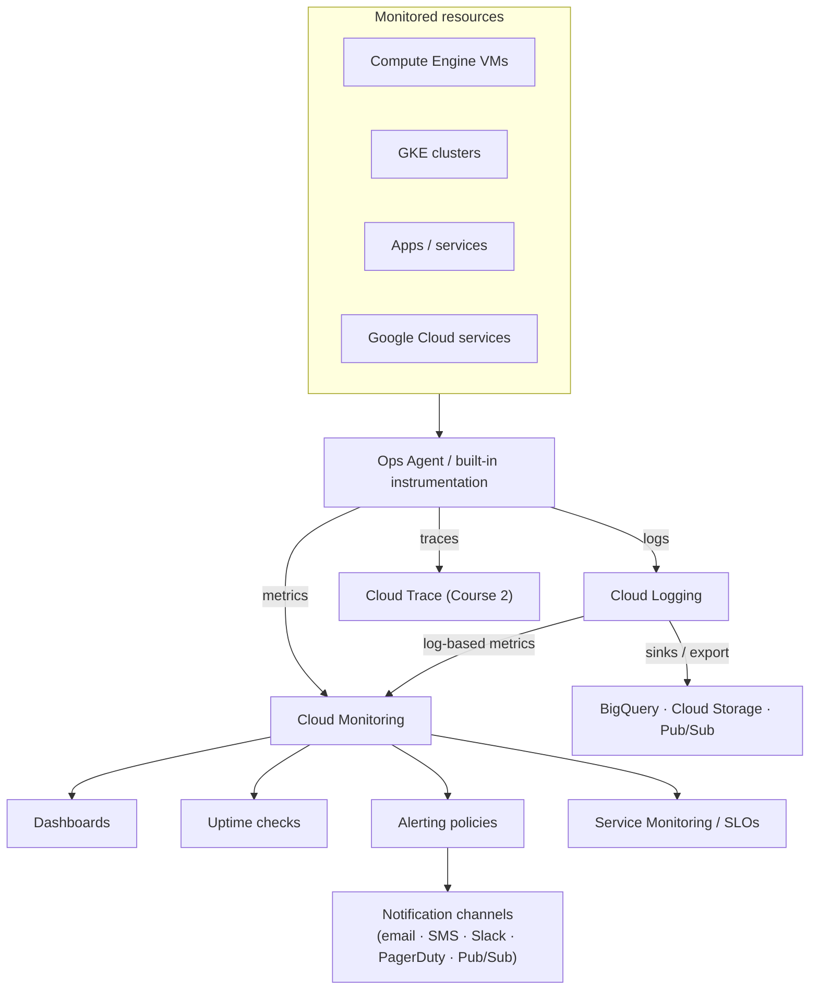

# 00 — Google Cloud Operations Suite: Overview

> Reference notes (see [provenance](README.md#provenance-read-me)). Append verbatim course
> content / screenshots as you go.

## The big picture

The Google Cloud **Operations suite** (formerly *Stackdriver*) is the built-in telemetry
platform for collecting, viewing, and acting on **metrics, logs, and traces** from your
resources and applications. The course frames the tools in **two categories**:

- **Operations-focused** — *is the system healthy and running?*
  - **Cloud Monitoring** — metrics, dashboards, uptime checks, alerting, SLOs
  - **Cloud Logging** — log collection, search, log-based metrics, routing/export
  - **Error Reporting** — aggregates and surfaces application errors
- **Application Performance Management (APM)** — *why is it slow / where's the bottleneck?*
  - **Cloud Trace** — distributed tracing / request latency (← Course 2, template 864)
  - **Cloud Profiler** — continuous CPU/memory profiling of production code

**This course (template 99)** covers the operations-focused side + **Service Monitoring
(SLOs)**. **Course 2 (template 864)** covers the APM side (Cloud Trace).

## How telemetry flows

## Key terms

| Term | Meaning |
|------|---------|
| **Metric** | A measured time-series value (CPU %, request count, latency…) with labels. |
| **Monitored resource** | The thing a metric is about (a VM, a container, a bucket…). |
| **Metrics scope** | A monitoring "view" that can span **multiple projects** (multi-project monitoring). |
| **Log entry** | A structured/unstructured record with a timestamp, severity, and resource. |
| **Log-based metric** | A metric derived by counting/matching log entries. |
| **Sink** | A route that exports matching logs to BigQuery / GCS / Pub/Sub. |
| **Uptime check** | A synthetic probe of an endpoint from multiple global locations. |
| **Alerting policy** | Conditions that open an **incident** and notify when telemetry crosses a threshold. |
| **SLI / SLO / error budget** | Indicator / target / allowed-failure — see [`04-service-monitoring-slos.md`](04-service-monitoring-slos.md). |

## Golden signals (what's worth monitoring/alerting on)

**Latency · Traffic · Errors · Saturation** — symptoms of user impact. Alert on these, not on
every low-level cause.

---
*Course diagram screenshots → paste them and I'll add a matching mermaid version here.*
