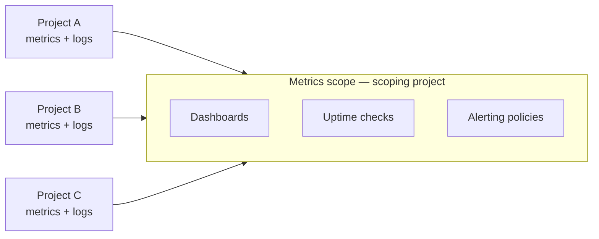

# 01 — Cloud Monitoring: Metrics, Dashboards, Uptime Checks

> Reference notes (see [provenance](README.md#provenance-read-me)). Maps to **L9.1 · L9.4** and
> the *Monitoring & Dashboarding Multiple Projects* lab.

## Metrics data model

- A **metric** is a **time series**: a stream of timestamped values, each tied to a
  **monitored resource** and a set of **labels** (dimensions you can filter/group by).
- **Metric type** identifies what's measured (e.g. `compute.googleapis.com/instance/cpu/utilization`).
- **Metric kind**: `GAUGE` (value at a point), `DELTA` (change over interval), `CUMULATIVE`
  (running total). **Value type**: bool/int64/double/distribution.
- Sources: Google Cloud built-in metrics, the **Ops Agent** (VM system/app metrics), and
  **custom / user-defined** metrics.

## Metrics scope (multi-project monitoring)

A **metrics scope** is what a monitoring **scoping project** can see. Add other projects to a
scope to build **dashboards, uptime checks, and alerts that span multiple projects** — the
key idea in the Lab 3 "multiple projects" scenario.

## Metrics Explorer

- Interactive builder to **query and chart** any metric: pick metric → filter by labels →
  group/aggregate (mean, sum, p50/p95/p99…) → choose chart type.
- Query languages: **MQL** (Monitoring Query Language) and **PromQL** for advanced queries.

## Dashboards

- **Custom dashboards** = collections of widgets (line, stacked bar, heatmap, scorecard,
  gauge, text). Build **golden-signal** dashboards (latency, traffic, errors, saturation).
- Prebuilt/auto dashboards exist per Google Cloud service.

## Uptime checks

- **Synthetic probes** of a public endpoint — **HTTP / HTTPS / TCP** — run from **multiple
  global locations** on a schedule (e.g. every 1/5/15 min).
- Configure: resource/URL + path, protocol, port, response validation, check frequency.
- **Pair with an alerting policy** so you're notified when the check fails from N locations.

## Takeaways

- Metric = time series + resource + labels; aggregate with percentiles for latency.
- Metrics scope is how you monitor **many projects from one place**.
- Golden-signal dashboard + uptime check + alert = the core "is it up and healthy?" loop.

---
*Course diagram screenshots → paste them and I'll add a matching mermaid version here.*
