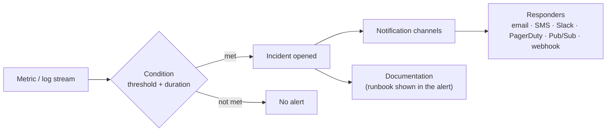

# 02 — Alerting in Google Cloud

> Reference notes (see [provenance](README.md#provenance-read-me)). Maps to **L9.2 · L9.4** and
> the *Alerting in Google Cloud* lab.

## Core idea: alert on impact, not noise

Good alerts fire on **symptoms that affect users** (high error rate, high latency, an SLO
burning) — not on every low-level cause. Too many noisy alerts → **alert fatigue** → real
incidents get missed.

## Anatomy of an alerting policy

- **Condition** — the test on telemetry. Types:
  - **Metric threshold** — value above/below X for a duration ("CPU > 80% for 5 min").
  - **Metric absence** — data stops arriving (a dead service).
  - **Forecast** — projected to cross a threshold within a window.
  - **Log-based (log match)** — a log entry matching a filter appears.
- **Duration / "for"** — how long the condition must hold before firing (kills flapping).
- **Notification channel** — where alerts go; **create it first**, then attach to the policy.
- **Incident** — the object opened when a condition triggers; auto-closes when it clears.
- **Documentation** — free-text/runbook surfaced in the notification (what to do).

## Log-based alerts

Fire directly on a **matching log entry** (e.g. a specific error string or an audit event) —
useful for events that aren't naturally a metric.

## Good practice

- Alert on the **golden signals** and on **SLO burn rate** (see [`04`](04-service-monitoring-slos.md)).
- Set thresholds + durations to match real user impact; write a **clear runbook** in the
  documentation field; route by severity to the right channel.

## Takeaways

- Policy = **condition(s) + duration + notification channel(s) + documentation**.
- Create the **notification channel first**, then build the policy and attach it.
- Prefer few high-signal alerts over many noisy ones.

---
*Course diagram screenshots → paste them and I'll add a matching mermaid version here.*
