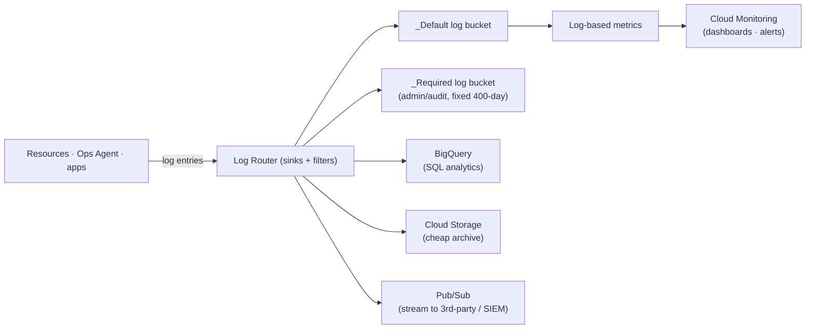

# 03 — Cloud Logging

> Reference notes (see [provenance](README.md#provenance-read-me)). Maps to **L9.1** (logging
> half of the operations suite).

## What it is

**Cloud Logging** ingests, stores, searches, and routes **log entries** from Google Cloud
services, the Ops Agent, and your apps. A **log entry** has a timestamp, **severity**
(DEBUG→DEFAULT→INFO→WARNING→ERROR→CRITICAL→ALERT→EMERGENCY), a monitored resource, and a
structured (`jsonPayload`) or text payload.

## Logs Explorer

- Search/filter with the **Logging query language**: by resource, severity, time range, text,
  or JSON fields (e.g. `severity>=ERROR AND resource.type="gce_instance"`).
- Save queries; build **log-based metrics** straight from a filter.

## The Log Router (sinks & routing)

Every entry hits the **Log Router**, which matches it against **sinks** and sends copies to
destinations. This is how you do **retention, analytics, archive, and streaming/export**.

- **Log buckets** — storage with configurable **retention**; `_Default` (30 days, editable)
  and `_Required` (audit/admin, 400 days, fixed).
- **Sinks** — filter + destination. Common exports: **BigQuery** (query logs), **Cloud
  Storage** (long-term archive), **Pub/Sub** (stream to external tools / SIEM).
- **Log-based metrics** — counter or distribution metrics derived from matching entries;
  bridge logs → Monitoring so you can **alert on log patterns**.

## Takeaways

- Everything flows through the **Log Router**; **sinks** decide what's kept/exported where.
- **BigQuery** = analyze, **Cloud Storage** = archive, **Pub/Sub** = stream out.
- **Log-based metrics** turn log events into alertable metrics.

---
*Course diagram screenshots → paste them and I'll add a matching mermaid version here.*
