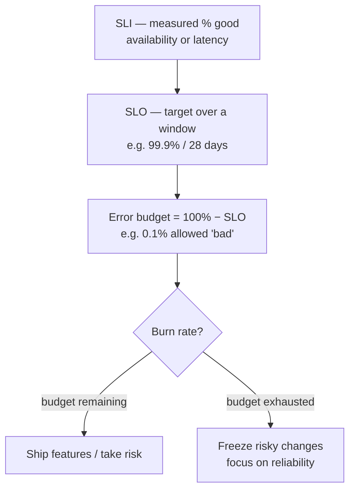

# 04 — Service Monitoring: SLIs, SLOs, Error Budgets

> Reference notes (see [provenance](README.md#provenance-read-me)). Maps to **L9.2** and the
> *Service Monitoring* lab — the most on-target lab in Module 9.

## The three definitions

- **SLI — Service Level *Indicator***: a **measured ratio of good events** to total, over a
  window. Two common shapes:
  - **Availability** = `successful requests / total requests`
  - **Latency** = `% of requests served faster than a threshold` (e.g. < 300 ms)
- **SLO — Service Level *Objective***: the **target** for an SLI over a **compliance window**
  — e.g. *99.9% of requests succeed over a rolling 28 days*. What you commit to internally.
- **Error budget** = **`100% − SLO`** — the amount of "bad" you're *allowed*. A 99.9% SLO ⇒
  **0.1%** budget. **Burn rate** = how fast you're spending it.
- **SLA — Service Level *Agreement***: the **contractual** promise (with penalties). Always set
  the **SLA looser than your SLO** so you have margin before breaching the contract.

## Request-based vs windows-based SLIs

- **Request-based** — ratio of good requests to total across the window (simple, common).
- **Windows-based** — fraction of **good time windows** (a window is "good" if it met a
  sub-goal); better for "no bad minutes" style goals.

## Why error budgets matter

They turn reliability into a **shared, quantifiable decision rule**: budget left → you can ship
and take risk; budget gone → **stop feature work, stabilize**. This aligns dev + ops instead
of "always 100%" (impossible/expensive).

## In Cloud's Service Monitoring

- Define a **service**, then create **SLOs** on it (pick SLI type, goal %, rolling/calendar
  window). The console shows **SLO compliance** and the **error-budget** burn chart.
- Add a **burn-rate alerting policy** to get paged when you're spending budget too fast.

## Takeaways

- **SLI = measure, SLO = target, error budget = 100 − SLO, SLA = contract (looser).**
- Error budget is the **decision rule** for shipping vs. stabilizing.
- Alert on **burn rate**, not raw values.

---
*Course diagram screenshots → paste them and I'll add a matching mermaid version here.*
